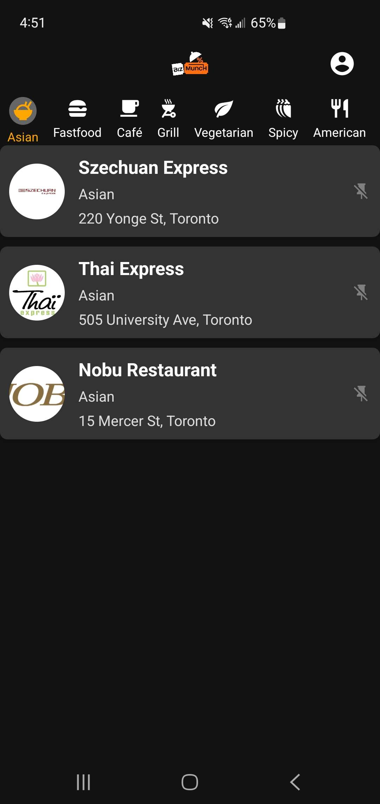
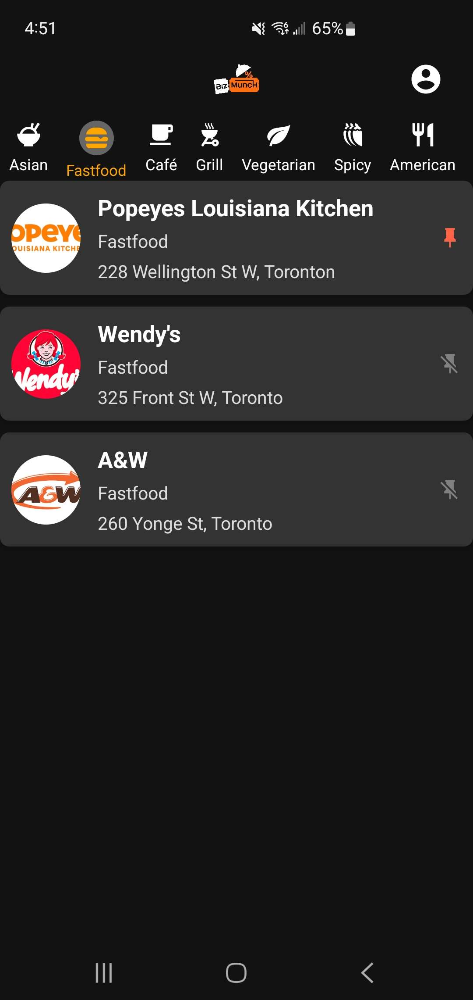
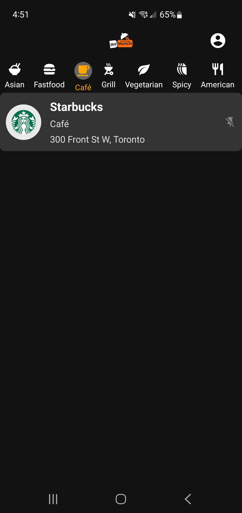
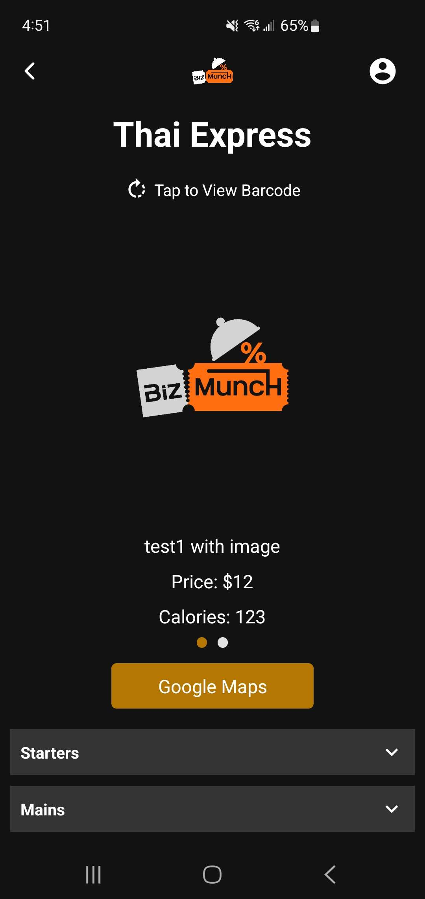
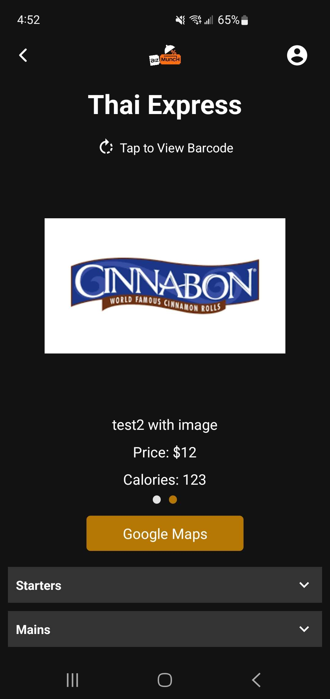
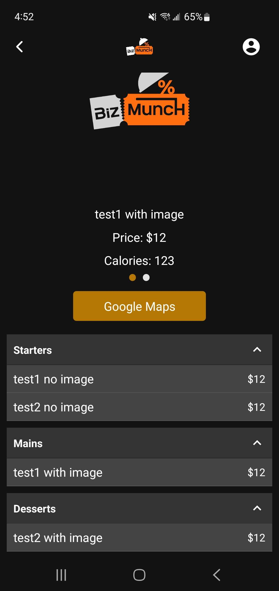
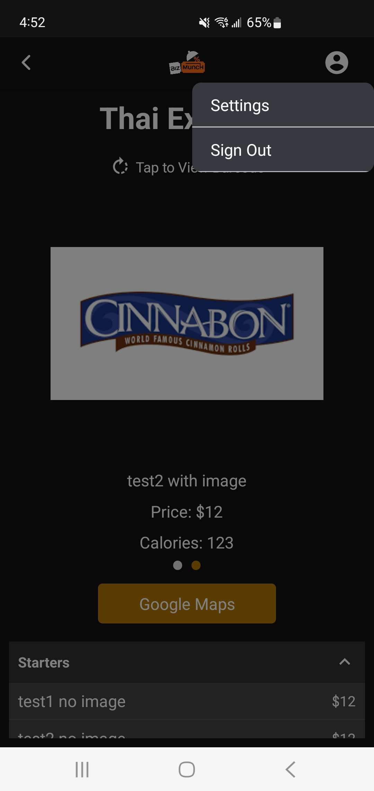
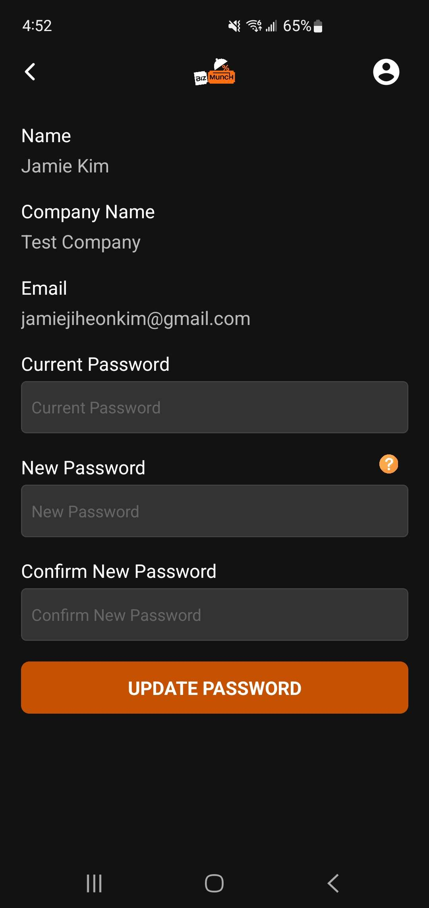

# Biz MuncH Mobile App

The customer-facing mobile application for Biz MuncH, a platform that connects users with exclusive discount coupons at local restaurants. Every Monday at midnight, users receive a fresh selection of 10 restaurants with special offers, creating an exciting weekly discovery experience while reducing dining costs.

## Overview

Biz MuncH solves a simple but frustrating problem: finding good restaurant deals without hunting through spam emails, clipping physical coupons, or downloading a dozen different restaurant apps. This app consolidates exclusive discounts from multiple local restaurants into one streamlined mobile experience.

**The problem this solves:** Restaurant discovery fatigue and coupon inconvenience. Users want variety in their dining options but don't want to spend time searching. The weekly rotation creates anticipation while keeping the selection manageable - 10 restaurants is enough for variety but not overwhelming. The ability to pin 2 favorites ensures users never lose access to their go-to spots.

## How It Works

### Weekly Rotation System
Once registered, each user receives **10 randomly selected local restaurants** with exclusive discounts. The selection rotates every **Monday at midnight**, giving users a new set of options each week. Restaurants from previous weeks can appear again in future rotations.

### Pinning Favorites
Users can **pin up to 2 restaurants** each week. Pinned restaurants remain in the next week's selection, ensuring continuous access to favorite discounts. This balances discovery with reliability - you get 8 new options while keeping your 2 favorites locked in.

### Discount Redemption
Each discounted menu item displays with an image carousel. Users can tap to flip the card and reveal a scannable barcode that restaurant staff use to apply the discount at checkout. No need to fumble with physical coupons or show cashiers screenshots.

### Integrated Features
- **Menu Access**: Browse full menus with prices, calories, and descriptions before visiting
- **Google Maps Integration**: One-tap directions to any restaurant location
- **Category Filtering**: Filter restaurants by cuisine type (Asian, Fastfood, Café, Grill, Vegetarian, etc.)

## System Architecture

### The Ecosystem

```
Mobile App (React Native) ⟷ REST API ⟷ MongoDB ⟷ Dashboard (React)
```

This mobile app is the **consumer-facing interface** for a larger restaurant discount platform:
- **Frontend**: React Native app with Expo for rapid development and deployment
- **Backend**: RESTful API (not in this repo) that handles authentication, rotation logic, and data queries
- **Database**: MongoDB for real-time data persistence
- **Dashboard**: Separate React web app (not in this repo) where admins manage restaurants, menus, and discounts

All restaurant data, menus, and discount information displayed in this app come directly from MongoDB. When admins add a new restaurant or update a menu item in the dashboard, those changes appear immediately in the mobile app.

### Key Architectural Decisions

**Context API for Auth State**: Initially considered Redux, but the auth state is the only truly global state in the app. Using Context API kept the bundle smaller and avoided Redux boilerplate for a single slice of state.

**AsyncStorage for Persistence**: User authentication tokens and pinned restaurants persist locally using AsyncStorage. This allows users to stay logged in across app restarts without requiring server calls on every launch.

**Stack + Tab Navigation**: The app uses React Navigation's stack navigator for auth flows (Login → Register → Verify) and switches to the main app navigator once authenticated. This pattern keeps unauthorized users locked out of the main app screens.

**Axios Centralization**: All API calls use Axios with the base URL defined in environment variables. This makes it easy to switch between development and production backends without touching code.

## Tech Stack & Why I Chose Each

### Core Framework
**React Native 0.74** with **Expo 51**. Went with React Native because:
- Cross-platform development (Android + iOS from one codebase)
- Strong component reusability across 15+ screens
- Massive ecosystem for libraries I needed (maps, carousels, barcode display)
- Native performance without writing Java/Kotlin or Swift

**Why Expo?** Expo simplified so much:
- No need to touch native code for most features
- `expo-location` for geolocation, `expo-secure-store` for token storage
- `expo-navigation-bar` to customize Android navigation bar colors
- Over-the-air updates without app store review (future feature)
- Easy builds with EAS (`eas build`)

### Language
**TypeScript** for type safety. Key benefits:
- Interface definitions for API responses caught mismatched data shapes
- Auto-completion in VS Code for component props saved hours of debugging
- Prevented errors when passing restaurant objects between screens

### Navigation
**React Navigation v6** with stack and tab navigators:
- **Stack Navigator**: Used for authentication flow (Login → Register → VerifyEmail)
- **Stack Navigator (Main)**: Used for authenticated app (Home → RestaurantDetails → MapModal)
- Conditional rendering based on `authState.authenticated` switches between auth and main navigators
- Type-safe navigation with TypeScript route params

### State Management
**Context API + React Hooks** for authentication state:
- `AuthContext` provides `authState`, `onLogin`, `onRegister`, `onLogout`, `togglePin`
- Persisted to AsyncStorage so tokens survive app restarts
- No need for Redux when only managing auth and pinned restaurants

**Local State for Everything Else**: Restaurant lists, menu data, loading states all use `useState`. These are fetched fresh on screen mount, so no need to cache globally.

### HTTP Client
**Axios** for all API calls:
- Cleaner syntax than `fetch`
- Easier error handling with try/catch
- Environment variable for `process.env.API_URL` makes backend swapping trivial
- Used in AuthContext for auth endpoints and screens for data fetching

### UI Components & Libraries

**react-native-reanimated-carousel**: Used for displaying discounted menu items:
- Smooth animations with 60 FPS
- Supports looping, auto-play, and custom widths
- Used for the flip animation (tap to show barcode on back of card)

**react-native-collapsible**: For menu category sections:
- Collapsible menu sections (Appetizers, Entrees, Desserts, etc.)
- Smooth expand/collapse animations
- Keeps long menus manageable

**react-native-maps**: Google Maps integration:
- Shows restaurant location with marker
- One-tap navigation via `Linking.openURL` to Google Maps app
- Users get directions without leaving the app

**@react-native-async-storage/async-storage**: Local data persistence:
- Stores auth tokens securely
- Persists pinned restaurants across sessions
- Automatically loads on app launch

**expo-location**: Geolocation services:
- Request user location permissions
- Used for proximity-based restaurant sorting (future feature)

**Material Community Icons**: Icon library for UI:
- Category icons (rice, hamburger, coffee, etc.)
- Navigation icons (chevrons, close buttons, map markers)
- Over 6000 icons available

### Animations
**React Native Reanimated + Animated API**:
- Flip animation for barcode reveal (rotates card 180 degrees)
- Uses `Animated.Value` and `interpolate` for smooth transitions
- Native driver for 60 FPS animations

### Build & Deployment
**EAS (Expo Application Services)** for building:
- Configured in `eas.json` with development and production profiles
- Handles Android keystore and signing automatically
- Can build APKs and AABs for Play Store submission

## Project Structure

```
app/
├── components/
│   ├── CustomButton.tsx          # Reusable button component
│   └── RestaurantCard.tsx        # Restaurant card with pin/unpin functionality
├── context/
│   ├── AuthContext.tsx           # Auth state management (login, register, logout, pinning)
│   └── FormValidation.tsx        # Form validation helpers
├── navigation/
│   ├── AppNavigator.tsx          # Main app navigation (authenticated users)
│   ├── AuthNavigator.tsx         # Auth flow navigation (login, register, verify)
│   └── DropdownMenu.tsx          # Dropdown menu component
├── screens/
│   ├── CategoriesList.tsx        # Horizontal scrollable category filters
│   ├── CategoryItem.tsx          # Individual category chip
│   ├── ForgotPassword.tsx        # Password reset flow
│   ├── ForgotPasswordVerify.tsx  # OTP verification for password reset
│   ├── Home.tsx                  # Main screen (displays RestaurantList)
│   ├── LoadingScreen.tsx         # Loading state with logo
│   ├── Login.tsx                 # Login screen
│   ├── MapModal.tsx              # Google Maps modal for restaurant location
│   ├── Register.tsx              # Registration screen
│   ├── RestaurantDetails.tsx     # Restaurant detail view (menu, barcodes, directions)
│   ├── RestaurantList.tsx        # List of 10 rotated restaurants
│   ├── UserData.tsx              # User profile display
│   ├── UserSettings.tsx          # Account settings (password change)
│   ├── VerifyEmail.tsx           # Email verification after registration
│   └── VerifyOTP.tsx             # OTP code input
android/                          # Native Android configuration
assets/                           # App icons, splash screen, images
App.tsx                           # Root component, renders auth/app navigator based on authState
index.tsx                         # Entry point, registers root component
```

### Design Patterns I Used

**Context Provider Pattern**: `AuthContext` wraps the entire app at the root level:
- Provides auth state and methods to all components
- Eliminates prop drilling for user data and auth functions
- Custom `useAuth` hook enforces usage within provider

**Conditional Navigation**: Root `App.tsx` renders different navigators based on authentication:
- If `authState.authenticated === false`, show `AuthNavigator` (Login, Register)
- If `authState.authenticated === true`, show `AppNavigator` (Home, RestaurantDetails)
- Loading screen displays while checking AsyncStorage for saved auth state

**Component Composition**: Screens are composed of smaller, reusable components:
- `RestaurantCard` used in `RestaurantList` with pin/unpin logic
- `CustomButton` used across auth screens for consistent styling
- `CategoryItem` chips used in horizontal category filter

**Optimistic UI for Pinning**: When users pin/unpin a restaurant:
- Update local state immediately (no loading spinner)
- Send API call in background to persist to MongoDB
- If API call fails, show alert but don't revert UI (prevents flashing)

**Memoized Filtering**: `RestaurantList` uses `useMemo` for filtering:
- Filters restaurants by selected category
- Sorts pinned restaurants to the top
- Only recalculates when `selectedCategory` or `pinnedRestaurants` changes

## Key Features

### For Users

**Weekly Restaurant Rotation**: Every Monday at midnight, users receive 10 new restaurants:
- API endpoint: `/users/rotated-restaurants/:userId`
- Backend handles rotation logic (random selection from available restaurants)
- Previous selections can reappear in future weeks

**Pin Favorites**: Users can pin up to 2 restaurants per week:
- Pinned restaurants persist in next week's rotation
- Visual indicator (pin icon) on restaurant cards
- Tap pin icon to add/remove from favorites
- Alert prevents pinning more than 2 restaurants

**Discount Redemption**: Tap-to-flip barcode display:
- Carousel shows all discounted menu items for a restaurant
- Tap card to flip and reveal scannable barcode
- Staff scan barcode at checkout to apply discount
- Smooth 180-degree rotation animation

**Menu Browsing**: Full restaurant menus with details:
- Collapsible sections by category (Appetizers, Entrees, Desserts, etc.)
- Each item shows name, price, calories, description, and photo
- Tap item to view full details in modal

**Integrated Directions**: One-tap Google Maps navigation:
- "Google Maps" button on restaurant detail screen
- Opens Google Maps app with restaurant location pre-loaded
- Uses `Linking.openURL` with encoded address query

**Category Filtering**: Filter restaurants by cuisine type:
- Horizontal scrollable chips at top of home screen
- Tap category to filter (Asian, Fastfood, Café, Grill, etc.)
- Tap again to clear filter and show all restaurants

### Technical Features

**Persistent Authentication**: Tokens stored in AsyncStorage:
- Users stay logged in across app restarts
- Auth state loads on app launch
- Token included in all API requests (future: add to Axios interceptor)

**Type-Safe Navigation**: TypeScript interfaces for route params:
- Prevents passing incorrect data between screens
- Auto-completion for navigation params in VS Code

**Responsive Layouts**: Works across different device sizes:
- Uses flexbox for responsive layouts
- Carousel width adapts to viewport width
- Modal components adjust to screen dimensions

**Dark Theme**: Consistent dark UI throughout:
- Background: `#121212` (true black for OLED screens)
- Accent: `#b57602` (orange/gold for buttons and highlights)
- Text: `#fff` (white for readability)

## What I Learned

### Technical Skills Gained

**Mobile-First Development**: This was my first production mobile app. Learned:
- Touch interactions are different from mouse clicks (tap targets need to be larger)
- Mobile users scroll vertically, so horizontal carousels need visual cues
- Navigation patterns on mobile (stack vs. tabs vs. drawer)
- Managing keyboard avoidance for text inputs

**React Native Specifics**: Coming from React web, I had to learn:
- No `<div>`, use `<View>`. No `<p>`, use `<Text>`
- Styling with StyleSheet API (similar to CSS-in-JS but more limited)
- Flexbox is default (no need for `display: flex`)
- No CSS selectors - all styles scoped to components
- Platform-specific code (`Platform.OS === 'android'` for Android-only features)

**Expo Ecosystem**: First time using Expo. Learned:
- When to use Expo Go (development) vs. Development Builds (custom native code)
- EAS CLI for building APKs and AABs
- Environment variables with `react-native-dotenv`
- Expo modules (SecureStore, Location, NavigationBar)

**State Persistence**: Managing state across app restarts:
- AsyncStorage is asynchronous (need `await` on every read/write)
- Load persisted state on app mount, show loading screen until ready
- Balance between what to persist (auth tokens) and what to fetch fresh (restaurant lists)

**TypeScript in React Native**: Type safety for mobile development:
- Defining interfaces for API responses caught data mismatches early
- Navigation types prevent passing wrong params between screens
- Props interfaces enforce correct component usage

**Authentication Flows**: Implementing secure auth on mobile:
- Context API for global auth state
- Conditional rendering of auth vs. main app navigators
- Token storage with AsyncStorage
- Password reset flow with OTP verification

### Challenges Overcome

**Hermes vs. JSC**: React Native 0.74 uses Hermes engine by default. Ran into issues with:
- Some libraries not compatible with Hermes
- Had to add `hermes-engine` to dependencies explicitly
- Debugged by checking logs with `npx react-native log-android`

**Android Keystore for Builds**: Setting up EAS builds required:
- Generating debug keystore for development builds (`keytool` command)
- Understanding signing configs in `android/app/build.gradle`
- Managing credentials in `eas.json`

**AsyncStorage Load Timing**: Initially had flashing screens because:
- App would render before AsyncStorage loaded auth state
- Users would see login screen for split second, then jump to home
- Fixed with loading state that blocks render until AsyncStorage resolves

**Barcode Flip Animation**: Getting the card flip animation smooth:
- Used `Animated.Value` with `interpolate` for rotation
- Had to use `backfaceVisibility: 'hidden'` in CSS to hide backside
- Native driver couldn't handle `rotateY`, had to use JavaScript driver

**Navigation Type Safety**: TypeScript + React Navigation requires:
- Defining param list types for each navigator
- Typing `route.params` in each screen
- Setting up `@react-navigation/native` types correctly

**Menu Data Transformation**: Backend returns menu as nested object:
- Had to flatten and transform into array for rendering
- Filter out metadata fields (`_id`, `description` at category level)
- Calculate average price across all menu items

### If I Built This Again

**React Query for API State**: Instead of `useState` + `useEffect` for data fetching, I'd use React Query:
- Automatic caching and refetching
- Loading and error states handled by library
- Less boilerplate per screen

**Zustand over Context API**: Context re-renders all consumers when any value changes:
- Zustand provides granular subscriptions
- Smaller bundle than Redux, simpler API than Context

**More Component Abstraction**: Some screens are 500+ lines:
- `RestaurantDetails.tsx` does too much (carousel, menu, barcode, modal)
- Should split into `MenuSection`, `BarcodeCarousel`, `ItemDetailModal` components
- Easier to test and reuse

**Error Boundaries**: Currently, if a screen throws an error, the whole app crashes:
- Would wrap screens in error boundaries with fallback UI
- Log errors to Sentry or similar service

**Testing**: No tests currently. Would add:
- Jest + React Native Testing Library for unit tests
- Detox for E2E tests (test login flow, restaurant selection, pinning)

**Offline Support**: Currently requires network for everything:
- Would cache restaurant data locally with AsyncStorage or SQLite
- Show stale data with indicator ("Last updated 2 hours ago")
- Queue pin/unpin actions when offline, sync when back online

**Accessibility**: Didn't think about screen readers until too late:
- Would add `accessibilityLabel` to all touchable elements
- Test with TalkBack (Android) and VoiceOver (iOS)
- Proper focus management for modals

**Performance Optimization**: Large restaurant lists could be smoother:
- Use `FlatList` with `windowSize` prop to virtualize long lists
- Memoize `RestaurantCard` with `React.memo` to prevent unnecessary re-renders
- Lazy load restaurant images with placeholder

## Getting Started

### Prerequisites
- Node.js 18+ and npm
- Android Studio (for Android development) or Xcode (for iOS development)
- Expo CLI: `npm install -g expo-cli`
- EAS CLI (for builds): `npm install -g eas-cli`

### Environment Variables

Create a `.env` file in the root:

```
API_URL=https://your-backend-api.com
```

### Installation

```bash
# Install dependencies
npm install

# Start Expo development server
npm start
```

This will open Expo Developer Tools. You can:
- Press `a` to open in Android emulator
- Press `i` to open in iOS simulator
- Scan QR code with Expo Go app on physical device

### Running on Android

```bash
# Run on Android emulator or connected device
npm run android
```

### Running on iOS

```bash
# Run on iOS simulator (macOS only)
npm run ios
```

### Building for Production

```bash
# Login to Expo account
eas login

# Configure project (first time only)
eas build:configure

# Build Android APK (for testing)
eas build --platform android --profile preview

# Build Android AAB (for Google Play Store)
eas build --platform android --profile production

# Build iOS (requires Apple Developer account)
eas build --platform ios --profile production
```

## API Endpoints Used

All API calls are made directly in screens and AuthContext. Key routes:

**Authentication:**
- `POST /users/register` - Register new user
- `POST /users/auth` - Login (returns JWT + user info + pinned restaurants)
- `POST /users/update-password` - Change password

**Restaurant Endpoints:**
- `GET /users/rotated-restaurants/:userId` - Get user's weekly 10 restaurants
- `GET /restaurant/:restaurantId/menu` - Get restaurant menu with items
- `POST /users/update-favorites` - Update user's pinned restaurants

**Future Endpoints** (not yet implemented):
- `GET /users/nearby-restaurants` - Get restaurants near user's location
- `POST /users/redeem-discount` - Log discount redemption

## Screen Shots

Here are some screenshots of the Biz MuncH mobile app in action:

<div align="center">

### Login & Authentication Flow


### Home Screen & Restaurant List



### Restaurant Details



### Menu & Item Details



### Additional Features


</div>

## License

This project is part of my portfolio. Feel free to look around, but please don't copy it wholesale for your own portfolio.
